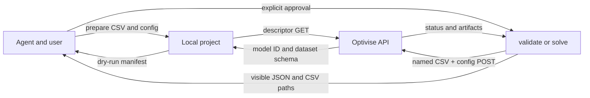

# Data flow

The dry-run branch stops before the submission `POST`. It reads files to calculate byte counts and SHA-256 hashes, but does not upload or write artifacts. A real run sends only the selected CSV files and configuration. A solve may write server-named CSV artifacts only after their names pass the local safety checks.
